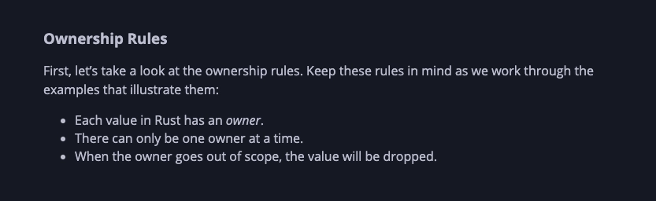

# Ownership of heap variables



Why does the following code not work?

```rust
fn main() {
    let str = String::from("Harkirat");
    let len = get_length(str);
    println!("{}", len);

    print!("{}", str);
}

fn get_length(str: String) -> usize {
    return str.len()
}
```

This code fails because the ownership of str is moved to the `get_length` function. Once the function’s scope ends, the str variable is no longer valid.

### Fix #1 - Transferring back ownership

```rust
fn main() {
    let str = String::from("Harkirat");
    let (str, len) = get_length(str);
    println!("{} {}", str, len);
}

fn get_length(str: String) -> (String, usize) {
    let len = str.len();
    return (str, len);
}
```